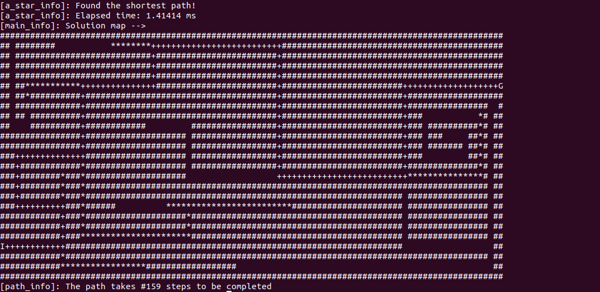

# A* algorithm
C++ implementation of A* path planning algorithm

## Build the program
```
mkdir build
cd build/
cmake ..
make
```

## Run the program
```
cd build/
./a_star
```

## Example of shortest path finder with a-star
